# Manual do Usuário — Sistema de Pedidos da Gráfica UFSM

Este manual explica, passo a passo, como usar o sistema de pedidos da Gráfica
Universitária da UFSM (Imprensa Universitária). Ele está dividido em duas partes:

- **[Parte 1 — Para o Cliente](#parte-1--para-o-cliente)**: quem precisa fazer um
  pedido de impressão (alunos, servidores, setores).
- **[Parte 2 — Para o Admin / Operador da Gráfica](#parte-2--para-o-admin--operador-da-gráfica)**:
  quem atende e produz os pedidos dentro da gráfica.

No fim há um **[Apêndice](#apêndice)** com tabelas de consulta rápida.

---

## O que é o sistema

É um site onde você monta seu pedido de impressão, envia os arquivos de arte,
acompanha a produção e é avisado quando o material está pronto para retirada —
sem precisar ir até o balcão para cada etapa.

## Como acessar

1. Abra o navegador e acesse o endereço do sistema (por exemplo,
   `http://localhost:3000` no ambiente de testes, ou o endereço informado pela
   gráfica).
2. Você verá a tela de **login**.

## Como entrar (login)

O acesso é feito pelo seu **CPF** ou pela sua **matrícula SIAPE**:

1. Digite seu CPF ou SIAPE no campo indicado.
2. Clique em **Entrar**.

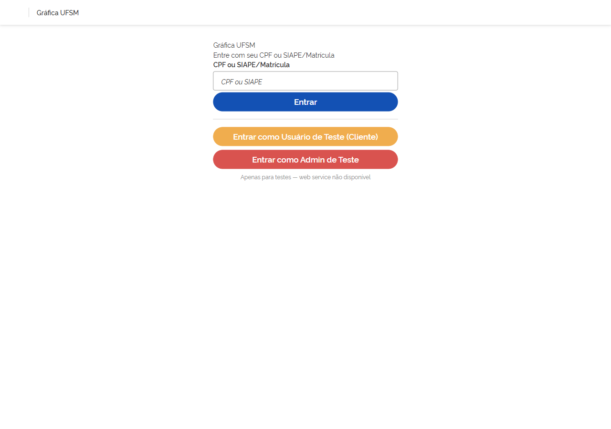

Se o número não for encontrado, aparece a mensagem *"CPF ou SIAPE não
encontrado."* — confira se digitou corretamente ou procure a gráfica para
verificar seu cadastro.

> Os botões **"Entrar como Usuário de Teste"** e **"Entrar como Admin de Teste"**
> que aparecem na tela são apenas para o ambiente de demonstração, enquanto a
> integração com o portal da UFSM não está ativa. Em produção, o acesso é pelo
> seu CPF/SIAPE.

> O sistema decide sozinho para onde te levar: clientes vão para a lista de
> pedidos; operadores e administradores vão para o painel da gráfica.

Para **sair**, use a opção **Sair** (logout) no menu.

---

# Parte 1 — Para o Cliente

Esta parte é para quem vai **pedir** uma impressão.

## 1. Entrar no sistema

Faça login com seu CPF ou SIAPE (veja [Como entrar](#como-entrar-login)). Você
cai direto na sua lista de pedidos. Da primeira vez, ela estará vazia.

## 2. Criar um pedido

Clique em **Novo pedido**. O pedido é montado em um assistente de **3 etapas**:

```
1. Itens  →  2. Acabamento  →  3. Confirmar
```

### Etapa 1 — Itens

1. Adicione um ou mais **itens**. Para cada item:
   - Escolha o **serviço** no catálogo (ex.: impressão laser, banner, crachá).
   - Informe a **quantidade**.
   - Se o serviço for cobrado por metro quadrado (como **banner**), informe a
     **largura** e a **altura** em metros.
   - Clique em **Adicionar item**: ele entra na tabela com o valor calculado.
2. O **preço de cada item é calculado na hora**, conforme a regra do serviço:
   - Serviços comuns: `preço unitário × quantidade`.
   - Banner e similares: `largura × altura × preço por m² × quantidade`.

> Você pode adicionar quantos itens quiser ao mesmo pedido. O **total** aparece
> abaixo da tabela.

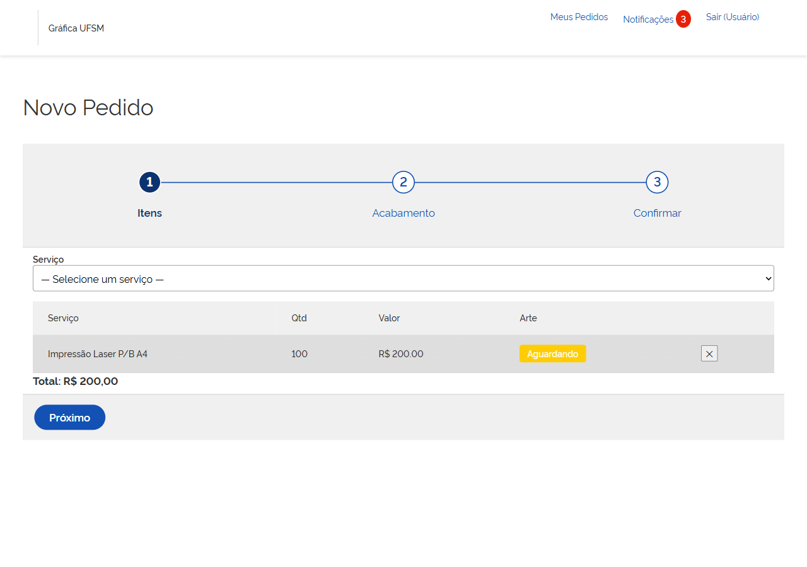

Clique em **Próximo** para ir ao acabamento.

> O **título** e as **observações** do pedido são preenchidos na última etapa
> (Confirmar).

### Etapa 2 — Acabamento

Escolha os acabamentos desejados para o pedido:

- **Plastificação** (sem plastificação, brilho ou fosco)
- **Grampo**
- **Vinco**
- **Cola**

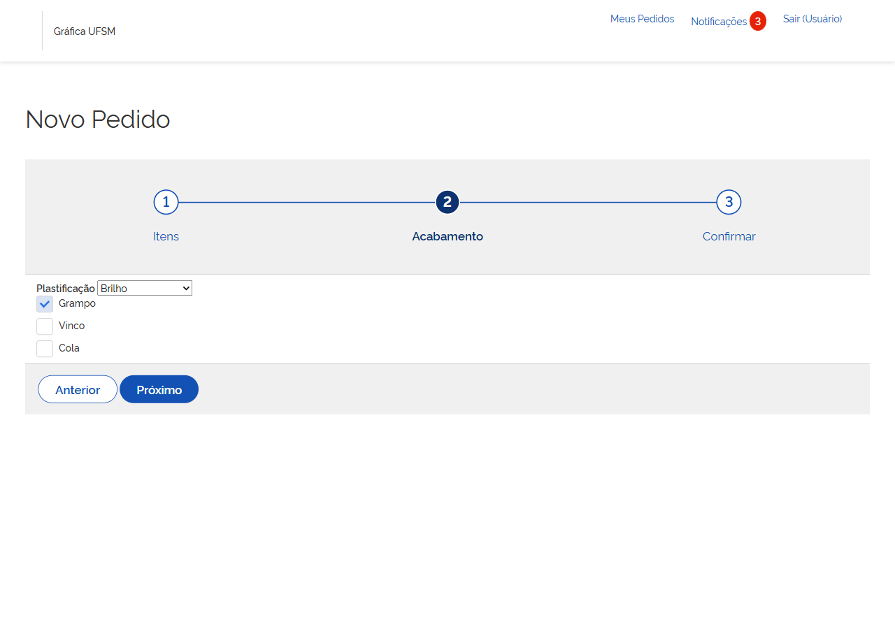

Marque o que precisar e clique em **Próximo**.

### Etapa 3 — Confirmar

1. Dê um **título** ao pedido (ex.: "Apostilas da oficina de robótica"). É
   obrigatório.
2. Se quiser, escreva uma **observação** para a gráfica.
3. Clique em **Salvar rascunho**.

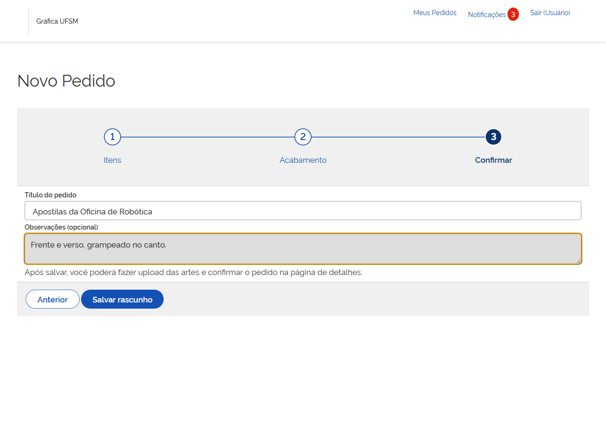

O pedido é gravado como **rascunho** — ou seja, ainda **não foi enviado** para a
gráfica. Você ainda precisa enviar as artes e confirmar (próximos passos).

## 3. Enviar a arte de cada item

Abra o pedido (clicando nele na lista). Para **cada item**, envie o arquivo de
arte:

1. Clique em enviar arquivo no item.
2. Escolha o arquivo no seu computador.

Formatos e limite aceitos:

| Formatos aceitos            | Tamanho máximo por arquivo |
| --------------------------- | -------------------------- |
| PDF, PNG, JPG, AI, CDR      | 50 MB                      |

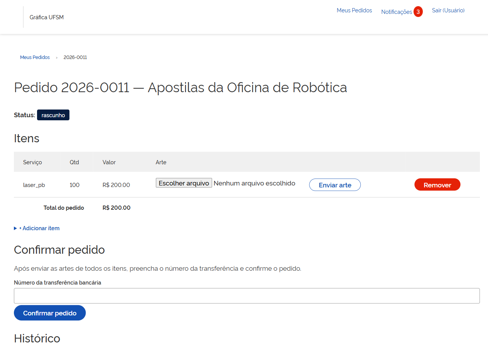

Se enviar um formato diferente, o sistema avisa: *"Formato não permitido. Use
PDF, PNG, JPG, AI ou CDR."*

Você pode **trocar** a arte (apagar a enviada e subir outra) enquanto o pedido
ainda for rascunho ou estiver em pendência.

> **Importante:** cada item precisa ter a sua própria arte. Não dá para confirmar
> o pedido com um item sem arquivo.

## 4. Confirmar (enviar) o pedido

Quando todos os itens tiverem arte, confirme o envio:

1. Informe o **número de transferência** (comprovante do pagamento/transferência
   interna). É obrigatório.
2. Clique em **Confirmar pedido**.

O sistema só deixa confirmar se:

- houver **pelo menos um item** no pedido;
- **todos os itens** tiverem arquivo de arte;
- o **número de transferência** estiver preenchido.

Ao confirmar, o pedido passa para **"aguardando análise"** e a equipe da gráfica
é avisada por e-mail. A partir daí, o pedido **não pode mais ser editado** — a não
ser que a gráfica o devolva como pendência.

## 5. Acompanhar o pedido

Na **lista de pedidos** você vê todos os seus pedidos e pode **filtrar por
status**. Para ver os detalhes, abra o pedido.

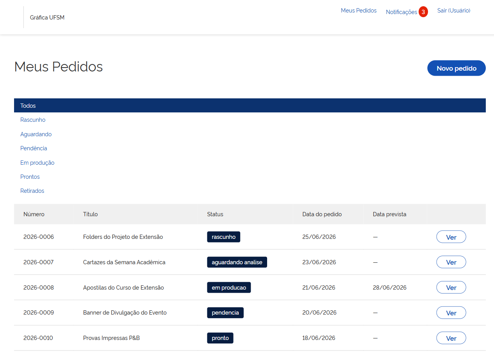

Você é avisado de duas formas conforme o pedido anda:

- **Notificações dentro do sistema** (contador no menu, no link **Notificações**).
- **E-mails**, em alguns eventos (pendência e pedido pronto).

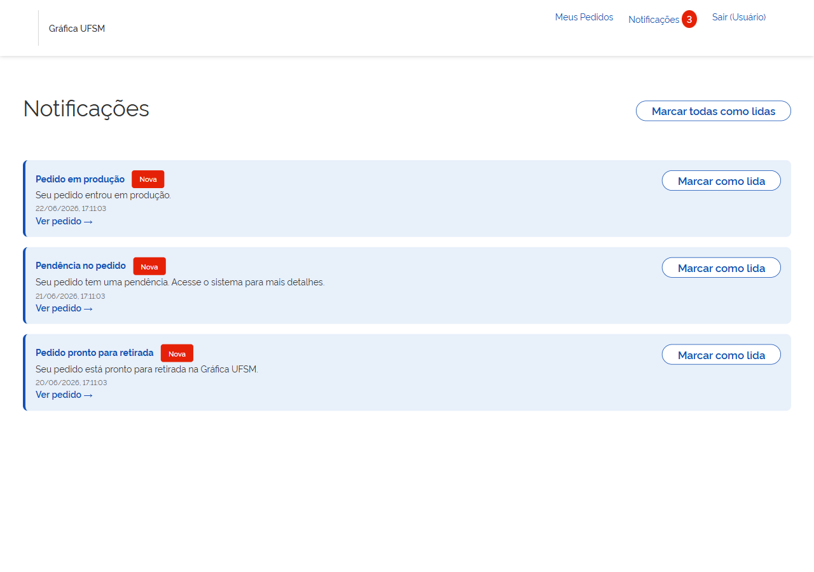

Veja o que cada status significa na
[tabela de status](#tabela-de-status-visão-do-cliente).

## 6. Resolver uma pendência

Se a gráfica encontrar algum problema (arte fora do padrão, dado faltando etc.),
ela devolve o pedido como **pendência**, sempre com um **comentário** explicando o
que precisa ser ajustado. Você recebe **notificação no sistema e e-mail**.

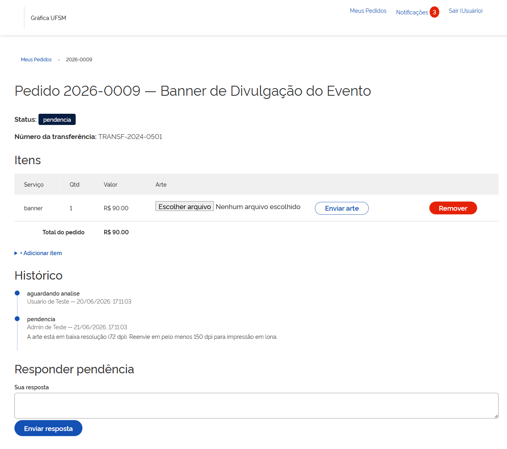

Para resolver:

1. Abra o pedido e leia o comentário da gráfica.
2. Faça os ajustes necessários — enquanto está em pendência, você pode **adicionar
   ou inativar itens** e **trocar as artes**.
3. Escreva uma **resposta** (comentário) explicando o que foi corrigido, se quiser.
4. Envie a resposta.

O pedido volta para **"aguardando análise"** e a gráfica é avisada novamente.

## 7. Retirar o pedido

Quando o status muda para **"pronto"**, você recebe aviso de que o material está
**pronto para retirada na Gráfica UFSM**. É só ir até a gráfica retirar. Depois da
retirada, a equipe marca o pedido como **"retirado"** e ele se encerra.

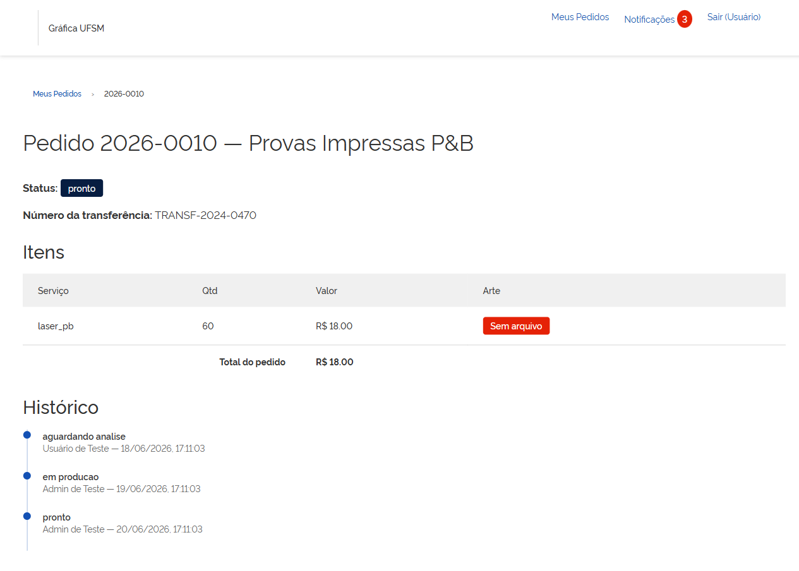

## Perguntas frequentes — Cliente

**Salvei o pedido mas a gráfica não recebeu. Por quê?**
Salvar deixa o pedido como **rascunho**. Ele só chega à gráfica depois que você
**confirma** (com todas as artes enviadas e o número de transferência). Veja o
[passo 4](#4-confirmar-enviar-o-pedido).

**Posso editar um pedido depois de confirmar?**
Não enquanto ele estiver em análise/produção. Só dá para editar se a gráfica
devolver como **pendência**.

**Meu arquivo não sobe.**
Confira o **formato** (PDF, PNG, JPG, AI ou CDR) e o **tamanho** (até 50 MB).

**Como sei que meu pedido andou?**
Pelas **notificações** no sistema e pelos **e-mails**. Você também pode abrir a
lista e filtrar pelo status.

**Posso ter vários itens diferentes no mesmo pedido?**
Sim. Adicione quantos itens precisar; cada um tem seu serviço, quantidade e arte.

---

# Parte 2 — Para o Admin / Operador da Gráfica

Esta parte é para a equipe que **atende e produz** os pedidos. Operadores e
administradores entram da mesma forma (CPF/SIAPE) e caem no **painel de pedidos**.

> **Diferença entre os perfis:** o **operador** gerencia pedidos e atualiza
> status. O **admin** faz tudo do operador **e** ainda gerencia o catálogo de
> serviços.

## 1. O painel de pedidos

Logo após entrar, você vê **todos os pedidos** dos clientes. É possível **filtrar
por status** (por exemplo, ver só os que estão "aguardando análise"). Clique em um
pedido para abrir os detalhes.

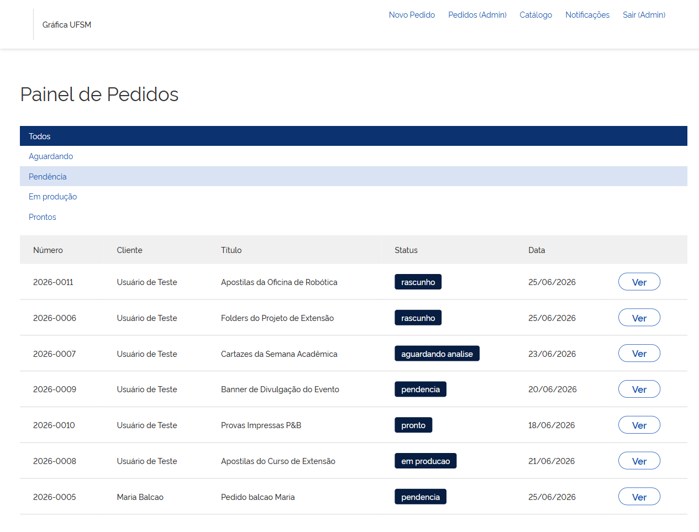

## 2. Analisar um pedido

Ao abrir um pedido você vê os **itens**, as **quantidades**, o **acabamento**, o
**número de transferência** e os **arquivos de arte** enviados pelo cliente.
Clique em cada arquivo para **visualizar/baixar** e conferir se a arte está
adequada para produção.

## 3. Mover o pedido (mudar o status)

Cada pedido segue uma **sequência de etapas**. O sistema só mostra as transições
**permitidas** a partir do status atual:

| Status atual         | Para onde pode ir                         |
| -------------------- | ----------------------------------------- |
| Aguardando análise   | Em produção · Pendência · Cancelado       |
| Pendência            | Em produção · Cancelado                   |
| Em produção          | Pronto · Pendência                        |
| Pronto               | Retirado                                  |

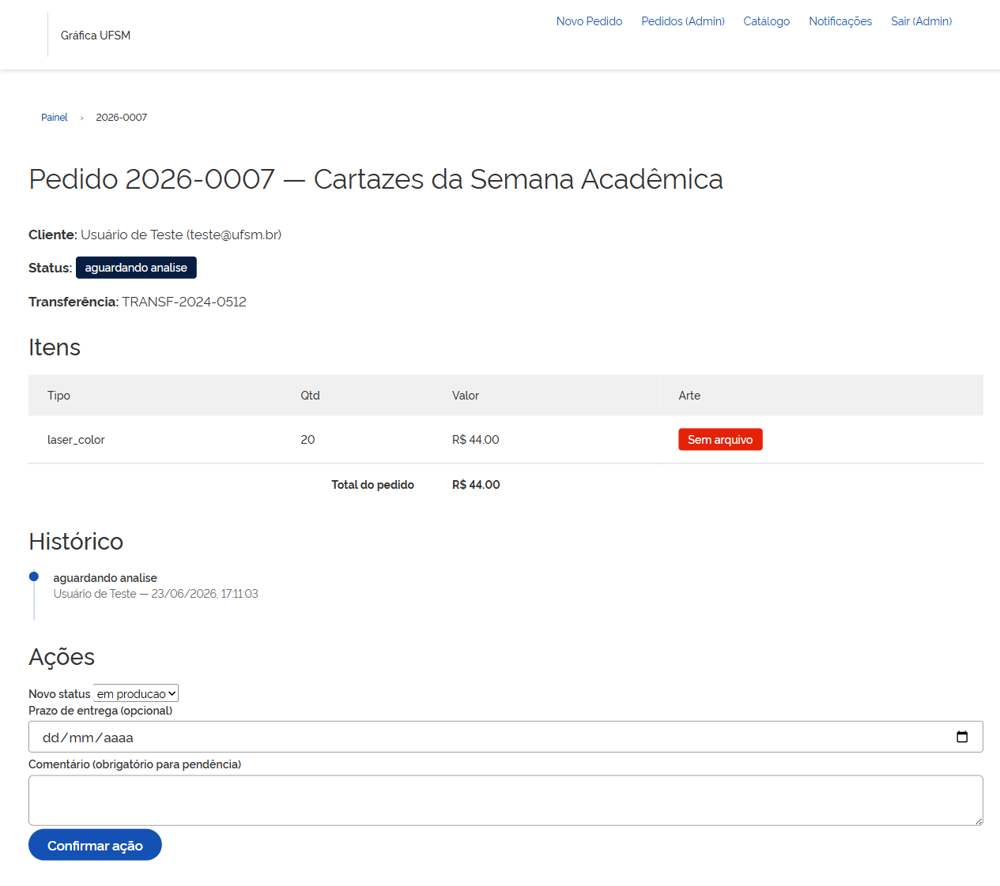

Regras importantes ao mudar o status:

- **Pendência exige um comentário.** Ao devolver um pedido como pendência, é
  **obrigatório** escrever o que precisa ser ajustado — esse texto é o que o
  cliente vê e recebe por e-mail.
- Ao mover para **em produção** ou outras etapas, você pode registrar um **prazo
  de entrega**, quando aplicável.
- Cada mudança de status fica registrada no **histórico** do pedido.

O que cada mudança **avisa ao cliente** está na seção
[Notificações e e-mails](#6-notificações-e-e-mails).

## 4. Atendimento de balcão (criar pedido pelo cliente)

Quando o cliente vem pessoalmente, você pode montar o pedido por ele:

1. **Identifique o cliente** por **CPF** ou **SIAPE**.
2. Se o cliente **já existe** no sistema, ele é carregado automaticamente.
3. Se **não existe**, informe **nome e e-mail** para cadastrá-lo na hora.
4. Crie o pedido normalmente (mesmo wizard de itens/acabamento) — ele ficará
   registrado **no nome do cliente**, não no seu.

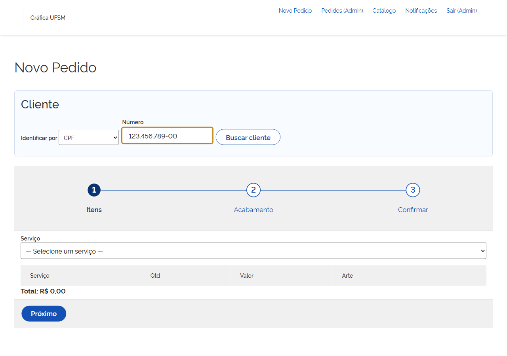

> Observação técnica: a integração automática com o portal da UFSM para puxar os
> dados do cliente ainda está prevista para o futuro. Por enquanto, o cadastro de
> um cliente novo é feito informando nome e e-mail no balcão.

## 5. Gerenciar o catálogo de serviços *(somente admin)*

O **catálogo** lista todos os serviços que o cliente pode escolher ao montar um
pedido. No menu de catálogo você pode:

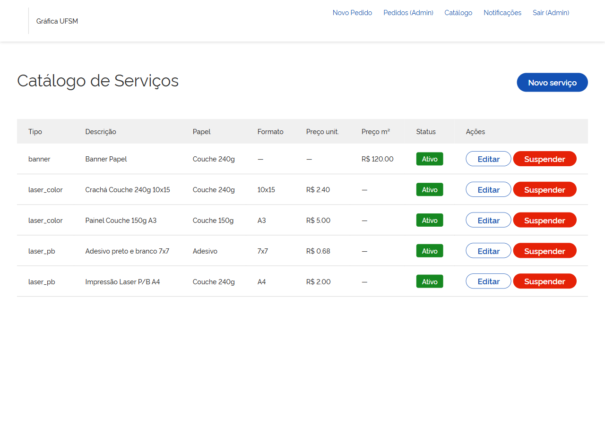

### Criar ou editar um serviço

Informe:

- **Tipo** (ex.: folder, cartaz, banner).
- **Descrição**.
- **Papel** e **formato** (quando se aplicam).
- O **preço**, de uma destas duas formas:

| Forma de cobrança      | Quando usar                         | Como o preço é calculado                       |
| ---------------------- | ----------------------------------- | ---------------------------------------------- |
| **Preço unitário**     | Itens vendidos por unidade          | `preço unitário × quantidade`                  |
| **Preço por m²**       | Itens por área, como **banner**     | `largura × altura × preço por m² × quantidade` |

> Defina **um** dos dois preços conforme o tipo de serviço. Serviços por m² pedem
> que o cliente informe largura e altura ao adicionar o item.

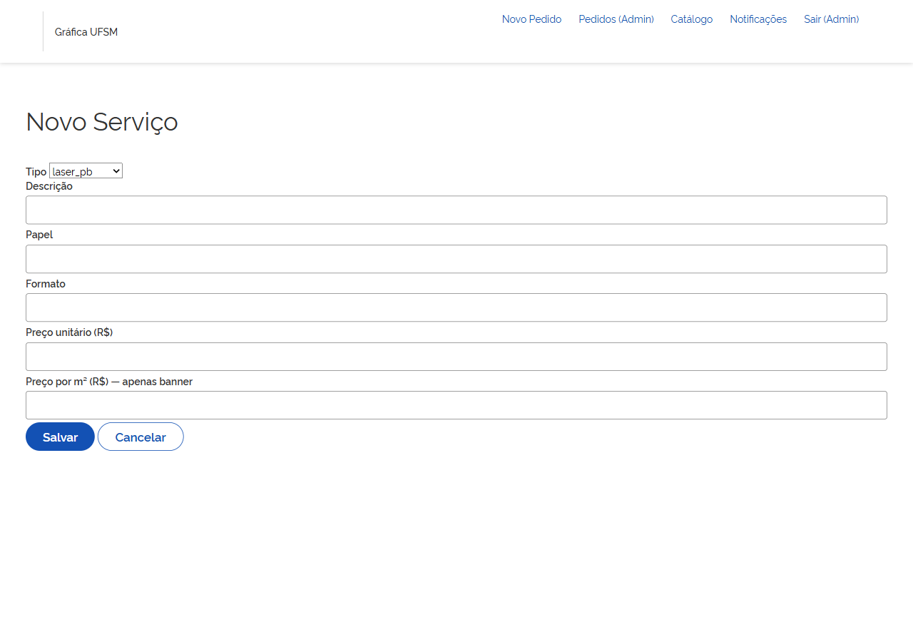

### Suspender um serviço temporariamente

Se um serviço ficar indisponível (falta de insumo, manutenção etc.):

1. Use **Suspender**.
2. Informe o **motivo** e, se quiser, uma **data até** quando ficará indisponível.

O serviço suspenso **deixa de aparecer** para os clientes na criação de pedidos,
mas continua no catálogo para você reativar depois.

### Reativar um serviço

Use **Reativar** para voltar a disponibilizar o serviço. O motivo e a data de
suspensão são limpos e ele volta a aparecer para os clientes.

## 6. Notificações e e-mails

Entender o que cada mudança dispara ajuda a alinhar a comunicação com o cliente:

| Evento (mudança de status)        | Notificação no sistema | E-mail                         |
| --------------------------------- | ---------------------- | ------------------------------ |
| Cliente **confirma** o pedido     | —                      | **para a equipe** da gráfica   |
| → **Em produção**                 | para o cliente         | —                              |
| → **Pendência**                   | para o cliente         | **para o cliente**             |
| → **Pronto**                      | para o cliente         | **para o cliente**             |

> Os e-mails têm prefixo `[Gráfica UFSM]` no assunto e incluem o número do pedido.

## Perguntas frequentes — Admin / Operador

**Não consigo mover o pedido para o status que eu quero.**
O sistema só permite as transições válidas a partir do status atual (veja a
[tabela do passo 3](#3-mover-o-pedido-mudar-o-status)). Por exemplo, de "pronto"
só se vai para "retirado".

**O sistema não deixa salvar a pendência.**
Pendência **exige comentário**. Escreva o que precisa ser ajustado antes de
confirmar.

**Criei o pedido mas ficou no meu nome.**
No atendimento de balcão, **identifique o cliente** (CPF/SIAPE) **antes** de
salvar. Sem isso, o sistema não cria o pedido pelo cliente.

**Um serviço sumiu para os clientes.**
Provavelmente está **suspenso**. Verifique no catálogo e use **Reativar**.

**Sou operador e não vejo o catálogo.**
A gestão do catálogo é exclusiva do perfil **admin**.

---

# Apêndice

## Tabela de status (visão do cliente)

| Status               | O que significa                                                       |
| -------------------- | -------------------------------------------------------------------- |
| **Rascunho**         | Pedido sendo montado. Ainda não foi enviado à gráfica.               |
| **Aguardando análise** | Enviado. A gráfica vai conferir os itens e as artes.               |
| **Pendência**        | A gráfica encontrou algo a ajustar. Veja o comentário e responda.    |
| **Em produção**      | Tudo certo; seu material está sendo produzido.                       |
| **Pronto**           | Material pronto para retirada na Gráfica UFSM.                       |
| **Retirado**         | Pedido retirado e encerrado.                                         |
| **Cancelado**        | Pedido cancelado pela gráfica.                                       |

## Tabela de perfis

| Perfil       | O que pode fazer                                                          |
| ------------ | ------------------------------------------------------------------------ |
| **Cliente**  | Criar pedidos, enviar artes, acompanhar status, responder pendências.    |
| **Operador** | Gerenciar pedidos, atualizar status, atendimento de balcão.              |
| **Admin**    | Tudo do operador **+** gerenciar o catálogo de serviços.                 |

## Fluxo do pedido (resumo)

```
rascunho ──► aguardando análise ──► em produção ──► pronto ──► retirado
                  ▲   │                  │
                  │   ▼                  ▼
                  └ pendência ◄──────────┘
                       │
                       ▼
                   cancelado
```

Como ler o diagrama:

- **Aguardando análise** pode ir para **em produção**, **pendência** ou **cancelado**.
- **Em produção** pode ir para **pronto** ou voltar para **pendência**.
- **Pendência**:
  - quando o **cliente responde**, o pedido volta para **aguardando análise**
    (caminho normal);
  - a **gráfica** também pode levá-lo direto para **em produção** ou **cancelado**.
- **Pronto** só vai para **retirado**.
